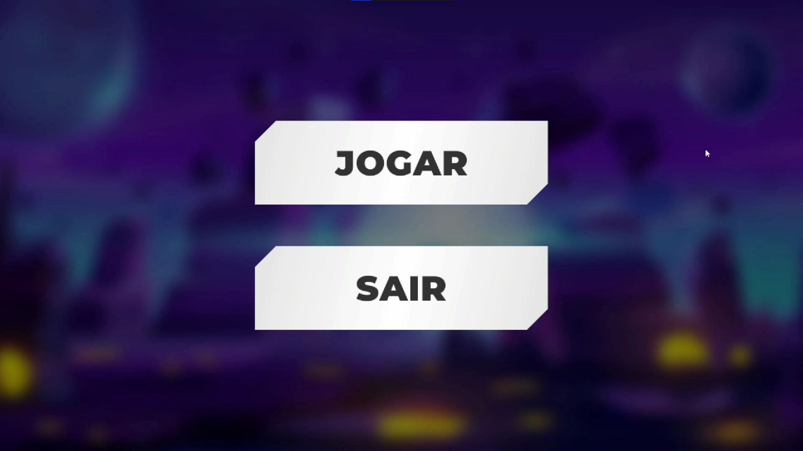

# 🚗 Cars vs Zombies

## 📖 Descrição

**Cars vs Zombies** é um jogo de ação e sobrevivência onde o jogador controla um carro responsável por proteger o último cérebro da humanidade contra uma invasão de zumbis.

Os zumbis surgem constantemente e tentam alcançar o cérebro. Para impedir o avanço deles, o jogador deve atropelá-los utilizando o veículo, eliminando o maior número possível de inimigos antes que eles destruam o último recurso da humanidade.

---

## 🎮 Como Jogar

### Controles

| Tecla | Ação |
|---------|---------|
| W | Acelerar |
| S | Ré |
| A | Virar para esquerda |
| D | Virar para direita |
| Espaço | Drift |

### Objetivo

- Proteja o cérebro dos ataques dos zumbis.
- Atropele os inimigos para eliminá-los.
- Evite colidir frequentemente com estruturas sólidas, pois isso danifica o veículo.
- Sobreviva o máximo de tempo possível.

---

# 🎥 Gameplay

**Vídeo no YouTube:**

[http://youtube.com/watch?v=8RFJeu32Kpo]

---

# 🖼️ Prints do Jogo

## Menu Principal



---

## Gameplay 1


---

## Gameplay 2


---

# ⚙️ Funcionalidades Implementadas

## 1. Dano nos zumbis baseado na velocidade do carro

### Descrição

Os zumbis recebem dano proporcional à velocidade do veículo no momento da colisão. Dessa forma, quanto mais rápido o jogador estiver, maior será o dano causado ao inimigo.

### Código

```csharp
private void TryDamageZombie(Collider other, float impactSpeed)
{
    if (impactSpeed < minimumImpactSpeed)
    {
        return;
    }

    Damageable zombieHealth = other.GetComponentInParent<Damageable>();
    ZombieController zombie = other.GetComponentInParent<ZombieController>();

    if (zombieHealth == null || zombie == null)
    {
        return;
    }

    if (requireZombieTag && !MatchesZombieTag(other, zombie))
    {
        return;
    }

    if (nextAllowedHitTimes.TryGetValue(zombieHealth, out float nextAllowedHitTime) && Time.time < nextAllowedHitTime)
    {
        return;
    }

    if (ignorePhysicalCollisionWithZombies)
    {
        IgnorePhysicalCollisionWith(zombie);
    }

    float damage = minimumDamage + impactSpeed * damagePerSpeed;

    if (zombieHealth.CurrentHealth <= executeHealthThreshold)
    {
        zombieHealth.Kill();
    }
    else
    {
        zombieHealth.TakeDamage(damage);
    }

    ZombieNavMeshMover mover = zombie.GetComponent<ZombieNavMeshMover>();
    if (mover != null)
    {
        float speedPercent = Mathf.InverseLerp(minimumImpactSpeed, maxKnockbackSpeed, impactSpeed);
        float knockbackDistance = Mathf.Lerp(minKnockbackDistance, maxKnockbackDistance, speedPercent);
        float knockupHeight = Mathf.Lerp(minKnockupHeight, maxKnockupHeight, speedPercent);
        Vector3 hitDirection = carRigidbody.linearVelocity.sqrMagnitude > 0.01f ? carRigidbody.linearVelocity.normalized : transform.forward;

        mover.KnockBack(transform.position, hitDirection, knockbackDistance, knockupHeight, knockbackDuration);
    }

    PreserveCarMomentum();
    nextAllowedHitTimes[zombieHealth] = Time.time + hitCooldown;
}
```

### Print da Funcionalidade


---

## 2. Dano no carro ao colidir com estruturas sólidas

### Descrição

O carro possui um sistema de vida. Quando ocorre uma colisão com estruturas do cenário, o veículo recebe dano proporcional ao impacto sofrido.

Isso incentiva o jogador a dirigir com cuidado enquanto combate os zumbis.

### Código

```csharp
private void OnCollisionEnter(Collision collision)
{
    if (IsZombieCollision(collision.collider))
    {
        return;
    }

    float impactSpeed = collision.relativeVelocity.magnitude;

    if (Time.time < nextDamageTime || impactSpeed < minimumDamageSpeed)
    {
        return;
    }

    if (!IsSolidDamageLayer(collision.collider.gameObject.layer))
    {
        return;
    }

    float damage = (impactSpeed - minimumDamageSpeed) * damagePerImpactSpeed;
    health.TakeDamage(damage);
    PlayCollisionSound(impactSpeed);
    nextDamageTime = Time.time + collisionDamageCooldown;
}
```

### Print da Funcionalidade


---

# 🛠️ Tecnologias Utilizadas

- Unity
- C#
- Unity Physics
- Input System

---

# 👨‍💻 Desenvolvedor

Rodrigo Castro
